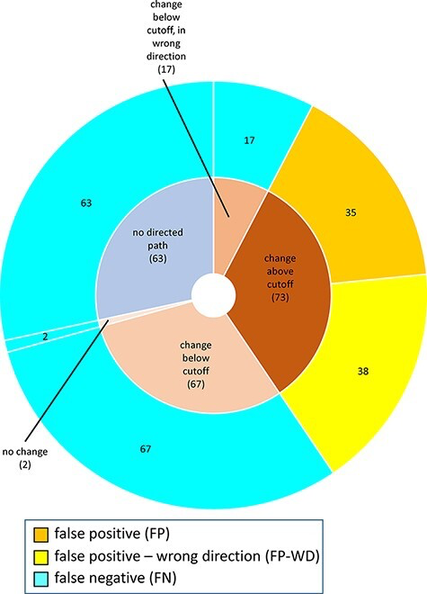
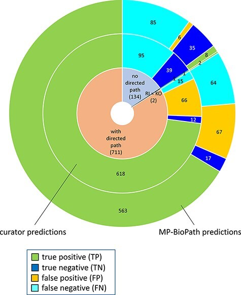

# GSoC 2026 Project Proposal: Improving MP-BioPath via Automated Genomic Integration and Quantitative Perturbation Analysis

**Organization:** Open Genome Informatics (Stein Lab / Reactome)  
**Project Length:** 175 Hours (Medium Scope)  
**Candidate:** Julian Benson  
**Background:** B.S. Biochemistry & Molecular Biology, Commonwealth Honors College, UMass Amherst  

---

## 1. Executive Summary & Project Abstract
The MP-BioPath algorithm has successfully demonstrated that manually curated Reactome logic graphs can predict the downstream effects of biological perturbations with ~75% accuracy across thousands of test cases (Wright et al., 2022). However, the tool currently operates primarily as a retrospective literature-validation engine, requiring manual definition of root inputs (RI) and key outputs (KO). 

To transition MP-BioPath into a high-throughput predictive engine for modern bioinformatics, this project will develop a polyglot (Python/R/Julia) integration pipeline. By automating the ingestion of quantitative genomic data (e.g., RNA-seq differential expression), mathematically mapping it to Reactome's continuous variable bounds, and resolving known inaccuracies regarding "Entity Set Dilution," Gene Expression Regulation (GER), and Ubiquitous Substrate computation, this project will enable researchers to rapidly predict pathway-level consequences of patient-specific genomic profiles.

---

## 2. Background & Biological Bottlenecks

### 2.1 The MP-BioPath Baseline & Optimization Thresholds
MP-BioPath translates Reactome pathways into Logical Networks. In its 2022 evaluation, the Stein Lab evaluated 18,539 test cases against experimental literature. As demonstrated in their ROC curve analysis (Figure 3), the authors identified that a computationally predicted continuous change of 15% maximized the F1 score for classifying discrete up/down biological regulation. However, the tool currently operates strictly as a retrospective literature-validation engine.

![Figure 3: The relationship between MP-BioPath sensitivity (TPR) and false positive rate (FPR) at different cutoffs.]   (fig3.png)  
*Figure 3: The relationship between MP-BioPath sensitivity (TPR) and false positive rate (FPR) at different cutoffs.*

### 2.2 Bottleneck A: The Non-Linear Dynamics of Gene Expression Regulation (GER)
While the 15% cutoff established a strong baseline, the study identified specific biological scenarios where predictive accuracy collapsed. As highlighted in the original author's error analysis (Figure 6), Gene Expression Regulation (GER) discrepancies formed a massive portion of the false negatives. 

Unlike rapid Post-Translational Modifications (PTM) which act as binary switches, transcription is inherently quantitative—relying on promoter affinities and mRNA accumulation. Standard logic graphs default to qualitative states, failing to capture the physical reality of transcriptomic accumulation. 

  
*Figure 6: Reasons for discordance between MP-BioPath-based predictions and published evidence, highlighting GER and Entity Set dilution.*

### 2.3 Bottleneck B: Entity Set Dilution & The 1/N Penalty
Figure 6 further highlights "Entity Set" discrepancies. Reactome frequently groups isozymes into unified sets. Currently, MP-BioPath assigns equal mathematical weights to all members. If a target node contains 10 tissue-specific isozymes, but only 1 is physically transcribed in the target tissue, the solver applies an artificial 1/10 weight reduction to the active node. This mathematical dilution dampens the calculated output signal, driving the prediction below the 15% threshold and generating a false negative.

### 2.4 Bottleneck C: Ubiquitous Substrate Combinatorics (Scale-Free Topologies)

Biological pathways are "scale-free networks," meaning a few nodes act as massive, hyper-connected hubs. From a pure graph-theory perspective, ubiquitous substrates (e.g., ATP, ADP, H2O, Ubiquitin, $H^+$) create dense algorithmic cycles. When fed into a non-linear optimization solver, these hub nodes cause an exponential increase in the required Jacobian matrix calculations, often leading to solver timeouts. Biologically, however, these substrates are buffered at physiological steady-states (e.g., intracellular ATP at 1-10 mM) and are rarely the rate-limiting perturbation in a specific signal cascade.

---

## 3. Proposed Architecture & Mathematical Models

To solve these bottlenecks, the project will be executed using a polyglot architecture: Python handles high-throughput graph/data manipulation, and Julia (`JuMP.jl`) executes the core non-linear optimization.

### 3.1 Module A: Genomic Data Ingestion & Boundary Mapping (Python)

MP-BioPath utilizes a mathematical model where node activity values must strictly range from $0.01$ (100x decreased activity) to $100.0$ (100x increased activity). Standard differential expression pipelines output a continuous $\log_2(\text{Fold Change})$.
Module A translates transcriptomic reality to solver boundaries:

1. **Statistical Filtering:** Eliminate biological noise by dropping genes where $p_{adj} > 0.05$.
2. **Transformation:** Convert $\log_2$ values to absolute multipliers using exponential transformation ($x = 2^{\log_2(\text{FC})}$).
3. **Solver Stability Constraints:** Hard-clip extreme values to exactly $[0.01, 100.0]$ to prevent the JuMP solver from diverging toward infinity during optimization.

### 3.2 Module B: Graph Stitching & API Traversal (Python)

The Stein Lab noted that false negatives spike significantly when biological paths cross arbitrary sub-pathway boundaries, leaving nodes disconnected (Figure 4). Module B will utilize the Reactome ContentService REST API (`/data/pathway/{id}/containedEvents`) to dynamically generate "Super-Logic Graphs."

  
*Figure 4: Distribution of predictions with respect to the existence of a directed path, demonstrating the false negative penalty of disconnected sub-pathways.*

* **Algorithm:** I will implement a Depth-First Search (DFS) walk-forward algorithm in Python. This will trace flow links across sub-pathway boundaries, dynamically fetching nested JSON logic tables to ensure terminal output nodes maintain mathematical linkage to the perturbed root inputs, explicitly solving the disconnected path issue shown in Figure 4.

### 3.3 Module C: Expression-Informed Penalty Coefficients (Julia / JuMP.jl)

The core of MP-BioPath minimizes the objective function, heavily penalizing deviations from the ideal calculated state:

$$minimize \sum_{i \in N} w_i(p_i + n_i)$$

Where $p_i$ and $n_i$ are positive/negative deviations, and $w_i$ is the node weight.

**The Innovation (Dynamic Weighting):** I will update the `JuMP.jl` objective function to incorporate Expression-Informed Penalty Coefficients. By passing the normalized RNA-seq counts from Module A into the Julia environment, the weight $w_i$ of an entity set member will be dynamically scaled:

$$w_i' = w_i \times (\text{Normalized Tissue Expression})$$

This forces the solver to heavily penalize deviations in physically transcribed isozymes while ignoring transcriptionally silent genes, completely resolving the Entity Set Dilution problem mathematically.

### 3.4 Module D: Matrix Dimensionality Reduction via Heuristic Pruning

To prevent computational bottlenecking, the Python pre-processor will utilize an exclusion dictionary of physiological buffer molecules (ATP, H2O, Pi). Rather than treating these hubs as unknown variables, the algorithm will mathematically constrain them as constants ($x = 1.0$). This domain-specific biological constraint drastically reduces the dimensionality of the matrices processed by the JuMP IPopt solver, improving execution speed and preventing combinatorial timeouts in massive Super-Logic Graphs.

---

## 4. Proposed 10-Week Timeline (175 Hours)

* **Community Bonding (May):** Finalize Julia/Python polyglot environment; define ubiquitous substrate exclusion lists with mentor; define JSON schemas.
* **Phase 1 (Weeks 1-4):** Develop `module_a_ingestion.py` for continuous log2 boundaries. Develop `module_b_graphs.py` to interface with the Reactome REST API and apply the Substrate Pruning algorithm (Module D) to the generated JSON graphs.
* **Phase 2 (Weeks 5-7):** Upgrade the `JuMP.jl` objective functions (Module C). Implement dynamic tissue-specific weighting ($w_i$) to resolve Entity Set Dilution.
* **Phase 3 (Weeks 8-10):** Benchmark the integrated pipeline against the "RAF/MAP kinase cascade" (Reactome ID: R-HSA-5673001) to ensure baseline accuracies (~94%) are maintained. Build reporting modules using the 15% biological significance threshold. Generate Dockerfiles and submit final PRs.

---

## 5. About the Candidate
As an undergraduate researcher in Biochemistry & Molecular Biology, I specialize in bridging the gap between physical cellular reality and high-throughput computational models. My independent quantitative coursework focuses heavily on RNA-seq differential expression, statistical validation, and dimensionality reduction. I utilize a polyglot architecture (Python, R, Julia) to ensure that the right tool is used for the right computational bottleneck, whether it is data munging or non-linear mathematical programming.

**References**
Wright, A.J., Orlic-Milacic, M., Rothfels, K. et al. Evaluating the predictive accuracy of curated biological pathways in a public knowledgebase. *Database* (2022). DOI: 10.1093/database/baac009